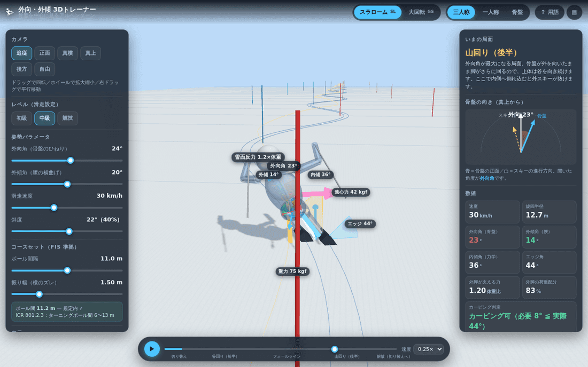
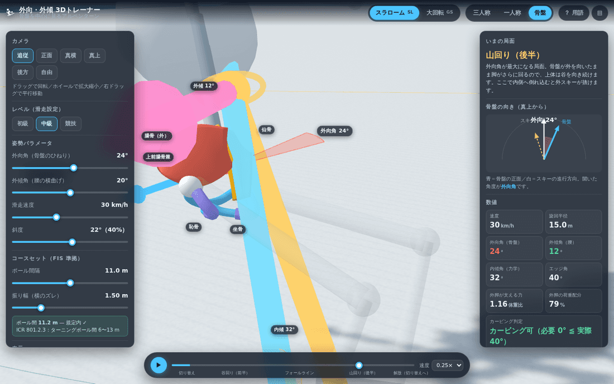
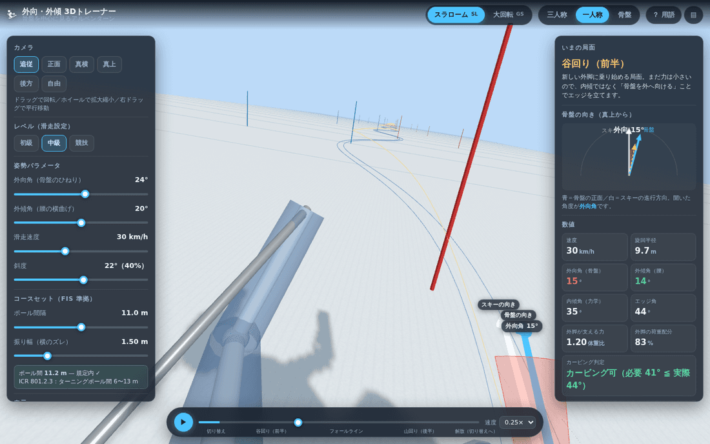
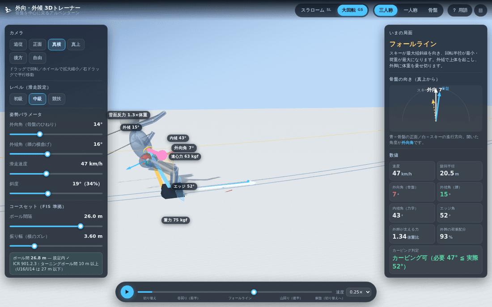

# 外向・外傾 3Dトレーナー — アルペンスキーのターンを骨盤から理解する

アルペンスキーのターンで使う **外向（がいこう）** — 骨盤をターンの外側へ向ける動き — を、
色分けした骨盤の 3D モデルと力のベクトルで見られる指導用ツールです。
ブラウザだけで動きます（ビルド不要）。



## できること

| | |
|---|---|
| **2 種目** | スラローム（SL）／大回転（GS）。コースセットと用具は FIS 規定の範囲で切り替わります |
| **骨盤の色分け** | 仙骨・腸骨（外側／内側）・坐骨・恥骨・大腿骨頭・上前腸骨棘を別色で表示。外側の腸骨は常に赤 |
| **3 つの視点** | 三人称（追従／正面／真横／真上／後方／自由）・一人称・骨盤クローズアップ |
| **力のベクトル** | 重力・遠心力・雪面反力・合力を、体重比の数値つきで表示 |
| **角度の可視化** | 外向角・外傾角・内傾角・エッジ角を扇形と数値で表示 |
| **レベル別** | 初級／中級／競技で速度と姿勢の大きさが変わります |
| **比較表示** | 「外向・外傾なし（内傾だけ）」のゴーストを並走させて違いを見る |

## 使い方

ES モジュールを使うので、ファイルを直接開くのではなく **HTTP で配信** してください。

```bash
# リポジトリのルートで
python3 -m http.server 8000
# → ブラウザで http://localhost:8000/ を開く
```

GitHub Pages にそのまま置いても動きます（ビルド手順なし）。
three.js は cdnjs から読み込むのでインターネット接続が必要です。

### キーボード

| キー | 動作 |
|---|---|
| `Space` | 再生／一時停止 |
| `←` `→` | コマ送り |
| `1` `2` `3` | 三人称／一人称／骨盤 |
| `S` | SL ⇄ GS |
| `F` | 力のベクトル表示 |
| `H` | 用語ヘルプ |
| `Tab` | パネルの表示／非表示 |

## この教材が伝えたいこと

### 1. 内傾角は「選べない」

ターン中の身体は、重力と遠心力の合力の向きに倒れます。剛体の釣り合いから

```
F雪面 = m (a − g)            a = v²/R（求心加速度）
```

で、この力の作用線は **接雪点と重心を結ぶ線に一致** します。
つまり内傾角 λ は速度・半径・斜度で決まってしまい、自分の意思で増減できません。

### 2. エッジ角を足せるのは外傾だけ

前額面（進行方向に垂直な面）で、脚の傾きを φ_leg、上体の傾きを φ_torso とすると

```
外傾角 α = φ_leg − φ_torso
エッジ角 ψ = φ_leg + 膝の角度
```

重心は下肢と上体の質量加重平均なので、**上体を起こす（α を大きくする）ほど、
同じ内傾角を保つために脚はより倒れます**。これが「身体を倒さずにエッジを立てる」外傾の正体です。
本ツールはこの関係を Dempster の分節質量比を使って数値的に解いています。

### 3. 外向は骨盤の「ひねり」

骨盤はスキーほど回りません。その差が外向角です。

```
外向角 φ = スキーの進行方向 − 骨盤の正面
```

山回りで最大になり、切り替えでほどけます。上前腸骨棘（ASIS）を結ぶ線と
青い矢印が骨盤の正面を示すので、スキーの向き（白い矢印）との差として見えます。

### 骨盤ビュー



仙骨（黄）・腸骨（外側＝赤／内側＝緑）・坐骨（紫）・恥骨（青）・大腿骨頭（白）・
上前腸骨棘（ピンク）に分かれています。青い矢印が骨盤の正面、赤い扇形が外向角です。

### 一人称視点



雪上で実際に見える景色に近い視点です。次の旗門を見ながら、腰がどちらを向いているかを
確かめられます。

### 大回転（GS）



### 指導での使い方の例

1. **真上**から見て、スキーの向き（白）と骨盤の向き（青）の差を確認する
2. **骨盤ビュー**に切り替え、山回り（位相 0.7〜0.9）で外側の腸骨（赤）が前に出るのを見る
3. **比較：外向なし** をオンにして、内傾だけの姿勢との差を並べて見る
4. 「外傾角」スライダーを 0 → 30° と動かし、**エッジ角とカービング判定** が変わるのを見る
5. **一人称**に切り替え、雪上で見えるはずの景色と腰の向きを結びつける

## モデルの前提（正直な注意書き）

- 軌跡は正弦波、滑走速度は一定の **準静的モデル** です。荷重の抜き差しや雪の変形、
  スキーのたわみは含みません。実測のピーク荷重（SL で約 4 体重、GS で約 3.2 体重）より
  小さい値が出ます。
- 外傾の配分（股関節 65 % ／腰椎 35 %）と、外向角の位相変化は指導上の想定値です。
- 人体は第三者の 3D アセットではなく、公表されている身体寸法比から手続き的に生成しています
  （出典は下記）。

## ファイル構成

```
index.html          画面
styles.css          UI のスタイル
src/constants.js    FIS 規定・身体寸法・色分けの定義
src/kinematics.js   軌跡と力学（内傾角・外傾角・荷重の計算）
src/pelvis.js       色分けした骨盤モデル
src/skier.js        全身リグ（骨格・身体・スキー）と IK
src/course.js       斜面・旗門・シュプール
src/forces.js       力のベクトルと角度の扇形
src/views.js        カメラ（三人称・一人称・骨盤）
src/ui.js           数値表示・骨盤コンパス・推移グラフ・ラベル
src/main.js         組み立てとループ
docs/REFERENCES.md  出典の一覧
```

## 出典

数値はすべて公式規定または公表文献に基づいています。詳細と URL は
[docs/REFERENCES.md](docs/REFERENCES.md) を参照してください。

- FIS, *The International Ski and Snowboard Competition Rules (ICR), Book IV — Alpine Skiing*（2025-05-21 版）
- FIS, *Specifications for Alpine Competition Equipment* 2024/2025
- Drillis & Contini (1966) の身体寸法比／Dempster (1955) の分節質量比
  （D. A. Winter, *Biomechanics and Motor Control of Human Movement*, 4th ed. に再録）
- three.js r186（MIT License, cdnjs 経由）

## ライセンス

MIT
