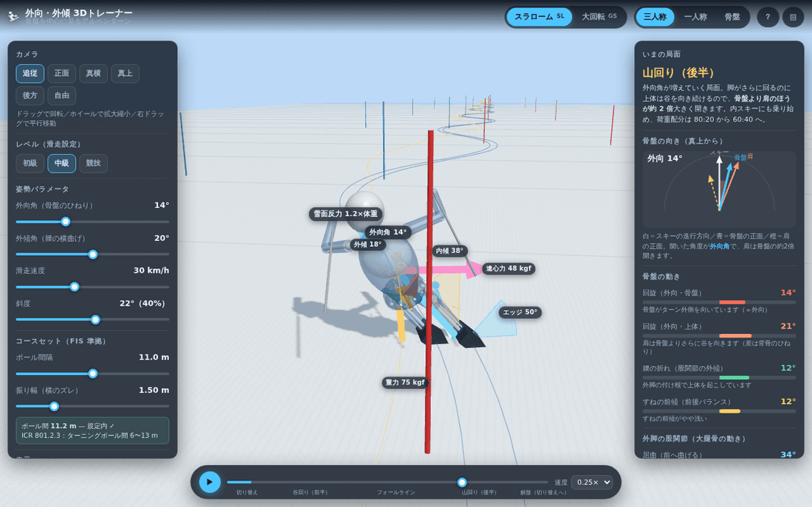
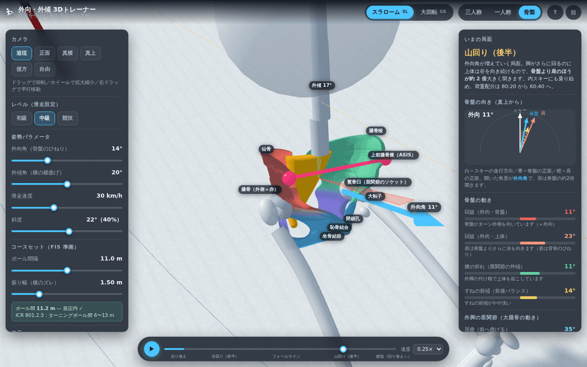
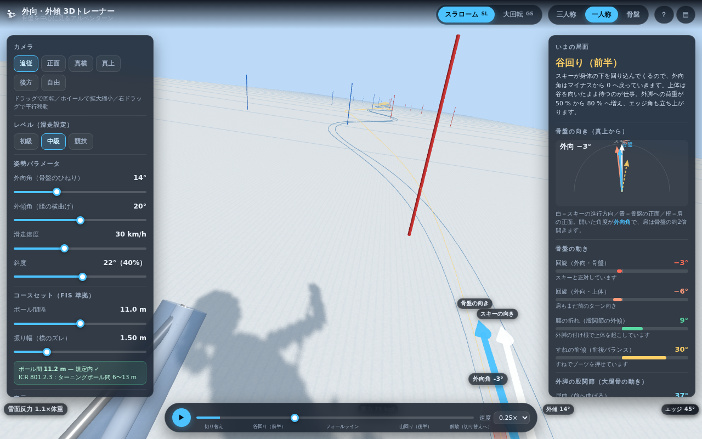
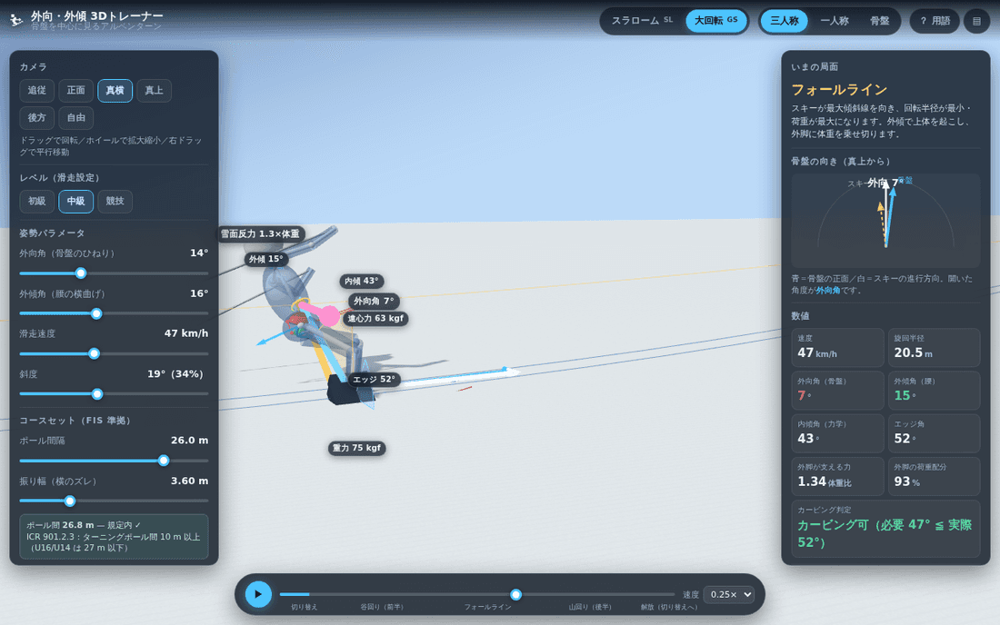

# 外向・外傾 3Dトレーナー — アルペンスキーのターンを骨盤から理解する

アルペンスキーのターンで使う **外向（がいこう）** — 骨盤をターンの外側へ向ける動き — を、
色分けした骨盤の 3D モデルと力のベクトルで見られる指導用ツールです。
ブラウザだけで動きます（ビルド不要）。



## できること

| | |
|---|---|
| **2 種目** | スラローム（SL）／大回転（GS）。コースセットと用具は FIS 規定の範囲で切り替わります |
| **骨盤の解剖** | 寛骨（腸骨・坐骨・恥骨）を閉鎖孔まで含めて立体化し、部位ごとに色分け。仙骨・尾骨・大腿骨頭・大転子・上前腸骨棘つき。外側の腸骨は常に赤 |
| **下肢の骨** | 大腿骨（骨頭・頸部・大転子・小転子・骨幹・内外側顆）、膝蓋骨、脛骨、腓骨。股関節で大腿骨がどう動くかが見えます |
| **体幹** | 椎骨 24 個（腰椎5・胸椎12・頸椎7）を 1 個ずつ連結し、肋骨 12 対・胸骨・鎖骨・肩甲骨まで。側屈・回旋・屈曲を部位ごとの可動域比で配分します |
| **2 つの画面** | **かんたん**（はじめての人：スキーヤーと「いま、やること」のカード 1 枚だけ）／**くわしく**（指導者：数値・グラフ・表示の切り替え）。上のバーか `D` キーで切り替え |
| **身体の表面** | 不透明なレーシングスーツ（配色・ゼッケン付き）。**骨盤のまわりだけ楕円の窓で透かして**、色分けした骨盤が見えます。見え方は「選手（窓なし）｜骨盤を透視（既定）｜X線（半透明の身体と骨格）」の 3 通り。表面は骨盤と各椎骨にぶら下げた「輪切り」の列なので、腰が曲がれば・ひねれば、そのとおりに変形します |
| **用具** | 板（黒い滑走面・銀のエッジ・プレート・ビンディング）、ブーツ（カフが足首で回る・バックル）、ストック（GS は曲がったベントストック、SL はハンドガード）、ヘルメット（SL はチンガード）。メーカーのロゴのない汎用品で、すべてコードで作っています |
| **力の掛け方** | 外スキーと内スキーの力を別々に表示。圧の中心（CP）が板の上を前後に動きます |
| **ポール処理** | SL は**外側の腕で旗門を払う（クロスブロック）**。ポールは弓なりにしなって揺れながら戻ります。GS は内側の肩と腕でパネルを押して旗門ごと傾けます |
| **動作ガイド** | **いま何をするか**を黄色い矢印と言葉で示します。かんたん表示では局面ごとに決めた指示を 1 つだけ（「骨盤は外へ向けたまま」のような「保つ」指示も出せる）。くわしく表示では、少し先の姿勢との差（時間微分）から上位 3 つ |
| **筋** | 主要な 23 筋群（体幹・股関節・脚・肩・腕）を起始・停止から描き、外力から逆算した関節モーメントで活動度を色分け |
| **腰と股関節の数値** | 骨盤：回旋（外向）／腰の折れ／すねの前傾。股関節：屈曲／外転・内転／回旋（内旋・外旋） |
| **まわりの世界** | 霧の先まで続く斜面、針葉樹の森、B ネット、山並みと太陽、青い影。雪の上には削れたレースライン、カービングの溝、雪煙（どれも滑走距離だけで決まるので、タイムラインを戻せば戻る） |
| **3 つの視点** | 三人称（追従／正面／真横／真上／後方／自由／**中継**＝斜面の下から長いレンズで）・一人称・骨盤クローズアップ |
| **力のベクトル** | 重力・遠心力・雪面反力・合力を、体重比の数値つきで表示 |
| **角度の可視化** | 外向角・外傾角・内傾角・エッジ角を扇形と数値で表示 |
| **お手本の滑り** | ゆっくり・小さめ／ふつう／レーサー で速度と姿勢の大きさが変わります（見る人のレベルではなく、お手本のほうの設定） |
| **比較表示** | 「外向・外傾なし（内傾だけ）」のゴーストを並走させて違いを見る |

## スマートフォンで見るとき

画面が狭いときは自動でレイアウトが変わります。

- **かんたん**：上のバーは 1 行（かんたん｜くわしく・視点・？）。3D が画面いっぱいに出て、
  下に「いま、やること」のカードと再生バーだけ。指示はカードに文字で出るので、3D の吹き出しは 1 つです
- **くわしく**：上に「局面・外向・内傾・雪から受ける力」の細いバー。操作パネルと数値パネルは
  下から出るシートになり、上部の **操作** / **数値** ボタンで 1 枚ずつ開きます
- 下のカードやシート、はじめのガイドが出ている間は、3D の絵をその上の空いた所へ寄せるので、
  骨盤も板も隠れません

## 使い方

ES モジュールを使うので、ファイルを直接開く（file://）のではなく **HTTP で配信** してください。

```bash
# リポジトリのルートで
python3 -m http.server 8000
# → ブラウザで http://localhost:8000/ を開く
```

GitHub Pages にそのまま置いても動きます（ビルド手順なし）。
three.js は `vendor/` に同梱しているので、**インターネット接続は不要**です
（ゲレンデの電波が弱い場所でも動きます）。

### かんたん と くわしく

既定は **かんたん** です。画面に出るのは、スキーヤー、黄色の指示 1 つ、下のカード（いま、やること）、
再生バーだけ。カードには局面の名前、いま、やること、なぜ、小さなコンパス（白＝スキー、青＝骨盤、
その間の赤＝外向角）が出ます。かんたんで出る数字は「外向 13°」の 1 つだけです。

指導者は上のバーの **くわしく**、キー `D`、または URL の `?mode=detail` で、数値・グラフ・表示の切り替えを出せます。
右パネルは「いま｜骨盤｜数値｜推移」のタブ、左パネルは折りたたみです。選んだほうは次回も使います
（URL の指定はそれより優先し、覚えている設定は書き換えません）。

実測（1440×900、位相 0.72 で止めた状態）：画面の文字のかたまり 98 → 15、数字 25 → 1、
ボタンと入力 27 → 12、パネルが画面を覆う割合 34 % → 6 %（下のカードを含む）。

### 再生の速さ

開いた直後（はじめのガイドが出ないとき）は、**2 ターンを実際の速さ（1.0×）で見せてから**、
0.6 秒かけてスロー ¼ へ落とします。ずっとスローのままだと、リズムが一度も伝わらないためです
（SL の 1 ターンは実際には 1 秒前後）。再生バーの「スロー ¼｜実際の速さ」で切り替え、
スロー中にもう一度押すと 1/10 になります。0.5× 以上で再生している間は、3D の文字を出しません
（1 秒に何度も変わって読めないまま点滅するため）。再生バーの下の 5 つの帯は局面で、押すとそこへ飛びます。

### はじめて開いたとき — 3 ステップのガイド

最初の 1 回だけ、画面の上（スマホは下）に小さなカードが出ます。
説明を読ませるのではなく、**ボタンを押すと画面がそのとおりに変わる**ようにしてあります。

| | 見るもの | ボタンで起きること |
|---|---|---|
| ① | 黄色い矢印と、下のカードの「いま、やること」 | 0.1 倍速で再生 |
| ② | 骨盤とスキーの向きを比べる（白＝スキー、青＝骨盤、その間の赤い扇＝外向角） | 骨盤アップへ |
| ③ | 外向なしの人と比べる（外向・外傾がないと、同じターンでも体を大きく倒すしかない） | 比較の人を横に並べる |

閉じる・飛ばす・`Esc` のどれでも終わり、表示と速さを元に戻して次からは出ません（ブラウザに印を残します）。
ヘルプ（？）の「はじめのガイドをもう一度」で何度でも出せます。
授業で配るときは URL の末尾に `?tour=0`（出さない）／`?tour=1`（必ず出す）を付けられます。
以前の版の ③ は「力と角度を表示する」で、いちばん情報の多い画面でガイドが終わっていたので差し替えました。

開いた直後は、外向と外傾がいちばんよく見える**山回り（後半）**から始まります
（切り替えから始めると、外向も外傾もほぼ 0 で「ただ立っている人」に見えるため）。

### 色の約束 — 入力と結果

初心者がいちばん迷うのは「どれが自分で変えられて、どれが勝手に決まるのか」なので、色と枠で分けています。

| 見た目 | 意味 | 例 |
|---|---|---|
| **青い実線** | 入力：自分でつくる量。左のつまみで変えられる | 外向角・外傾角・速度・コースセット |
| **紫の点線** | 結果：入力とコースから力学で決まる。つまみはない | 内傾角・エッジ角・雪からの力・旋回半径 |
| **灰の点線** | 想定：レベルごとに置いたモデルの仮定 | 外脚の荷重配分・圧の前後位置 |

左パネルの入力のブロック、右パネルの「数値」、3D の吹き出し、スマホの上のバーが、すべて同じ約束で分けてあります
（数字の色はそろえ、枠の線＝実線か点線かで見分けます）。

もう 1 つの約束：**黄色は「いま、これをする」だけ**（動作ガイドの矢印と吹き出し、カードの指示）。
以前は仙骨・重力の矢印・内傾角の扇・重心の印まで黄色系で、黄色が 9 通りの意味を持っていました。
かんたん表示では骨盤も 3 色だけ（外側の寛骨＝赤、内側＝緑、左右の上前腸骨棘を結ぶ「骨盤の正面」の線＝白）。
部位ごとの 7 色と骨の名前は、くわしく表示と骨盤アップで出ます。

### キーボード

| キー | 動作 |
|---|---|
| `Space` | 再生／一時停止 |
| `←` `→` | コマ送り |
| `1` `2` `3` | 三人称／一人称／骨盤 |
| `S` | SL ⇄ GS |
| `D` | かんたん ⇄ くわしく |
| `F` | 力のベクトル表示 |
| `H` | 用語ヘルプ |
| `Esc` | ヘルプ・はじめのガイドを閉じる |
| `Tab` | パネルの表示／非表示 |

## この教材が伝えたいこと

### 1. 内傾角は「選べない」

ターン中の身体は、重力と遠心力の合力の向きに倒れます。剛体の釣り合いから

```
F雪面 = m (a − g)            a = v²/R（求心加速度）
```

で、この力の作用線は **接雪点と重心を結ぶ線に一致** します。
つまり内傾角 λ は速度・半径・斜度で決まってしまい、自分の意思で増減できません。

### 2. エッジ角を足せるのは外傾だけ

前額面（進行方向に垂直な面）で、脚の傾きを φ_leg、上体の傾きを φ_torso とすると

```
外傾角 α = φ_leg − φ_torso
エッジ角 ψ = φ_leg + 膝の角度
```

重心は下肢と上体の質量加重平均なので、**上体を起こす（α を大きくする）ほど、
同じ内傾角を保つために脚はより倒れます**。これが「身体を倒さずにエッジを立てる」外傾の正体です。
本ツールはこの関係を Dempster の分節質量比を使って数値的に解いています。

### 3. 外向は骨盤の「ひねり」— ただし符号が変わる

身体はフォールラインを向き続けるので、スキーとの向きの差がそのまま外向になります。

```
外向角 φ = スキーの進行方向 − 骨盤の正面
```

大事なのは**符号が変わる**ことです。

| 局面 | 外向角 | 身体の状態 |
|---|---|---|
| 切り替え | **マイナス** | まだ前のターンの向きに残っている |
| フォールライン | ほぼ 0 | スキーと正対 |
| 山回り | プラス最大 | 脚だけが回り、上体は谷を向いたまま |

さらに、ひねりの大半は**背骨から上**で作ります。骨盤はスキーに比較的正対したままで、
肩は骨盤の約 2 倍開きます（SL で骨盤 18°／肩 35°）。コンパス図では
白＝スキー、青＝骨盤、橙＝肩の 3 本で見えます。

### 骨盤ビュー



寛骨は、外から見た輪郭（上前腸骨棘・腸骨稜・坐骨結節・恥骨結合など）と閉鎖孔から
立体を起こし、腸骨稜の隆起・坐骨棘・恥骨結節・仙骨の正中稜と仙骨孔まで作り込んで、腸骨（外側＝赤／内側＝緑）・坐骨（紫）・恥骨（青）を頂点カラーで
塗り分けています。3 つの骨は寛骨臼（股関節のソケット）で癒合しているので、
その周辺では色がなめらかに移り変わります。仙骨は黄、上前腸骨棘はピンク、
大腿骨頭と大転子は白。ラベルは実際の形状から計算した位置に出ます。

青い矢印が骨盤の正面、赤い扇形が外向角です。この視点ではカメラが骨盤の座標系に
固定されるので、ターン中も同じ解剖学的な向きから観察できます。

### 脚で角度をつくり、上体は立てる

「上半身はもっと立てていないか。下半身だけ角度をつけていないか」— そのとおりでした。
測ったら、最大荷重のところで**体幹が鉛直から 48.6°、脚が 59.9°、差は 11° しかない**。
ほとんど全身で倒れていました。

原因は 4 つあって、いちばん効いていたのは**エッジ角が脚の傾きに連動していた**ことです。

```
（前）エッジ角 = 脚の線 ＋ 膝の角付け
```

これだと上体を起こそうとして脚を寝かせた瞬間、エッジ角まで一緒に増えて 80° を超えます。
そこで**プラットフォーム角**から導くように変えました。エッジ角を決めているのは
「雪面反力の作用線に対して、板の裏をどれだけ起こしておくか」です。作用線は内傾角 λ で
決まっているので

```
（後）エッジ角 = λ ＋ プラットフォーム角（SL 13°・GS 11°）
     膝・足首の角付け = エッジ角 − 脚の線      ← 引き算で出てくる
```

**脚の線をどれだけ寝かせても、差を膝と足首が吸収するだけで、エッジ角は物理で決まった値から動きません。**
これが「下半身だけで角度をつくる」仕組みそのものです。

残りの 3 つ：

- **外傾角が小さすぎた**（SL 24°→**42°**、GS 20°→**33°**）。股関節が担う割合も 65%→**78%**。
  腰椎の側屈可動域は左右 25〜30° しかないので、背骨で作ろうとすると足りないうえ上体が倒れます。
  競技者が「脚だけ角度をつけて上体は立てて」見えるのは、**曲げている場所が腰ではなく股関節**だから。
- **脊柱の「まっすぐ」が 28.6° 後ろに倒れていた。** 腰椎前弯→胸椎後弯と積み上げると、
  曲がりが下（長いてこ）で先に起きるぶん、屈曲 0 でも腰→肩の線が後傾します。
  仙骨の前傾を土台に入れ、前傾は背中を丸めるのではなく**股関節で折る**ように変えました。
- **脊柱の側屈が逆向きだった。** 外傾は「上体を起こす」動きなのに、脊柱が傾きを足す側に働いていました。

| | 前 | 後 |
|---|---|---|
| 体幹（前額面・斜面法線から） | −40.1° | **−26.6°** |
| 脚の線 | −65.4° | −65.4°（変えていない） |
| **脚と体幹の差** | **25.3°** | **38.8°** |
| 体幹（矢状面） | −22.4°（後傾） | **+16.8°（前傾）** |
| エッジ角 | 71.5° | 71.6°（物理で決まるので不変） |

### 骨盤は前に傾けて、股関節で折る

「この骨盤で大丈夫か」と見直したら、**骨盤が後ろへ 4〜16° 倒れていました**（後傾）。
骨盤の上下軸を「脚の線と上体の線の間」に置いていたので、上体が前傾しても骨盤はそれに付いていくだけで、
股関節はほとんど曲がっていなかったのです（大腿と骨盤のなす角が 13〜29°）。
レーサーの構えは逆で、**骨盤が前に傾き、その上に上体が乗り、股関節が深く曲がっている**。
初心者に「腰が引けている（後傾）」の見本を見せていたことになります。

そこで骨盤の前傾を**斜面の法線から測った目標値**として直接与え（切り替えで 10°、荷重が乗るほど深く最大 28°）、
腰椎はその前傾の 8 割を打ち消して上体の向きを保つようにしました。

| 競技・SL | 前 | 後 |
|---|---|---|
| 骨盤の前傾（斜面法線から） | −14〜−4°（後傾） | **+10〜+28°** |
| 股関節の屈曲（大腿と骨盤） | 13〜29° | **37〜61°** |
| 体幹の前傾 | 2〜21° | **8〜28°** |
| 体幹の横の傾き（最大荷重） | −27° | −26°（ほぼ変えていない） |

GS 競技は股関節 26〜52°、中級 SL は 43〜65°。前額面の「脚で角度をつくり上体は立てる」は崩していません。
数値パネルの「腰の折れ」も、前傾ぶんが混ざらないよう前額面だけで測るように直しました。
前傾の大きさ（10°／28°）は**調整値**で、実測の関節角に合わせたものではありません。

### 板を雪の上に戻した

「まだイマイチリアリティがない」と言われて全体を見直したら、いちばん効いていたのは技術ではなく**不具合**でした。
**板とブーツが、どの局面でも雪面の下 8〜12 cm に埋まっていた**のです。どの視点からもブーツしか見えず、
外向の基準になる「スキーの向き」がそもそも見えていませんでした。

原因は重心合わせです。描いた身体の重心を力学モデルの重心に合わせるために、スキーヤー全体を平行移動していて、
そのとき板とブーツまで一緒に動いていました（ずれは最大 19 cm）。いまは全体を動かさず、足は雪面の板の上に固定し、
ずれは**腰の位置**で吸収します。

- 力の線（接雪点 → 重心）に沿ったずれは内傾角に効かないので捨てる
- 横のずれは力の線に垂直に、前後のずれは斜面に沿って動かす（前後の上限 13 cm・調整値）
- 回数を固定して直すので、補正量は位相の連続関数のまま（切り替えで跳ばない）

板はたわまない剛体なので、エッジを立てるとショルダーとテールがウエストより下に出ます。
そこで「板の裏のいちばん低い点」を雪面に合わせています。

### 「椅子に座った」構えを直した

板を雪に戻したら、別の問題が見えました。腰が後ろに引けたまま、切り替えでは膝を 87° 曲げているのに
上体は 8〜11° しか前へ倒れておらず、真横から見ると**椅子に座った後傾**に見えました。
山回りの後半では、すねが板の法線から 9〜14° まで立っていました（レース用ブーツのカフの前傾より立っている）。

- **しゃがむほど骨盤ごと前へ倒す**：脚を畳むほど上体も前へ。すねと背中がだいたい平行になる
- **すねの前傾の下限 17°**：下回りそうなら腰を少し下げ（膝をもう少し曲げ）てすねを前へ倒す

| 競技・SL | 前 | 後 |
|---|---|---|
| 上体の前傾（切り替え） | 8° | **26°** |
| すねの前傾（最小） | 14° | **19°**（GS 競技 9° → 18°） |
| 膝の屈曲（最大荷重付近） | 46〜53° | 59〜61° |

どちらの値（18°・17°）も調整値です。

### 見た目を選手に — 不透明なスーツと骨盤の窓

以前の身体は、半透明の殻の中に骨格がぜんぶ透けて見える「X 線の人形」でした。どの距離から見ても選手には見えず、
TV で見る距離（9〜10 m）では白い雪に溶けて形も分かりませんでした。

いまの既定は**不透明なレーシングスーツ**で、**骨盤のまわりだけ楕円の窓で透かして**います。
窓は教材としての「切り抜き」で、縁の白い輪がその目印です（黄色は「いまやる動作」専用なので使わない）。

| 見え方 | 中身 |
|---|---|
| 選手 | 窓なし。上前腸骨棘の高さに腰のライン（外側＝赤・内側＝緑）を描く |
| 骨盤を透視（既定） | スーツ ＋ 骨盤の窓 |
| X線 | 以前の半透明の身体と骨格。筋肉を出すと自動でこれになる |

用具もコードで作り直しました（メーカーのロゴなしの汎用品）。スーツは濃い地に白い帯と紺の肩、
胸と背中にゼッケン。膝と肘は 1 本の筒を関節のまわりで曲げるので「球をつないだ人形の関節」に見えません。
板は黒い滑走面と銀のエッジ、プレートとビンディング付き。外スキー＝コーラル・内スキー＝青は、
上面のストライプと側面に残しました。ブーツのカフは足首で回り、SL はすね当て付き。
ストックは長さ一定（身長 × 0.66、一般的な目安で未検証）で、GS は曲がったベントストック、SL はハンドガード付き。

描画の負荷はむしろ下がりました（不透明にしたぶん、透けて見える骨を描かなくてよい）。

### 白い板の上ではなく、レースの斜面で

以前は、空に浮いた白い板の上を滑っていました。板の端が地平線に見え、等高線の格子がかかり、
木も山もないので、斜度もスピードも伝わりませんでした。いまは（`src/environment.js`）：

- コースの両側は土手になって、霧の向こうまで続く（SL 約 420 m・GS 約 520 m で霞に溶ける）
- 針葉樹の森（700 本、スマホは 350 本を 1 回の描画で）、高さ 2.0 m の B ネット、山並みのパノラマと太陽
- 横からの日差しで、日なたの雪は白く、影は青い（トーンマッピングを ACES → Neutral。ACES は雪を灰色に沈めていた）
- 環境マップが空を映すようになった（以前は空が映らず、ゴーグルや金属が真っ黒だった）
- 雪の上の手がかりは**いつも出す**：削れたレースライン、両スキーのエッジの溝（滑ったところにだけ伸びる）、
  外スキーのテールから飛ぶ雪煙（荷重とエッジ角が大きいときだけ）。等高線 31 本と黄色のフォールラインは消した
- ポールは 1 本の筒を弓なりに曲げる（以前は 3 節の棒が折れて見えた）。カメラと骨盤の間に入ったポールは自動で薄くなる
- 三人称の画面の「上」を世界の鉛直にそろえた。以前は斜面の法線が上だったので、横から見ると斜面が水平に見え、
  身体が重力に逆らって傾いているのが読めなかった
- 「中継」カメラ：斜面の下 30 m から縦の画角 9° の長いレンズで（デスクトップで選手が画面の高さの約 3 割）
- 追従カメラの、速さに応じた遅れをなくした（等倍速で SL 1.2 m・GS 1.9 m → 0 m）
- 骨盤アップでは森・ネット・地形・山並みを隠し、背景を無地の霞にする（色分けした骨盤だけが目立つように）

1440×900 の既定の画面（かんたん・SL）で、描画コールは 445（前の版）→ 約 120、三角形は 17.8 万 → 約 15 万。
森や地形を足しても、スーツとまとめた用具のぶんで描画コールは前の版の 4 分の 1 ほどです。

### なめらかさは「測って」直した

「ポールに向かうまで上半身がスムーズじゃない」という指摘を、目で直すのではなく
**測って**直しました。1 ターンを 2000 点に刻んで身体の各点の位置を重心基準で取り出し、
1 階・2 階差分を見ます。見るのは値の大きさではなく形です。

- **1 点だけ跳ねている → 不連続**（そこで何かが切り替わっている）
- なだらかな山 → 本当に速く動いているだけ

見つかった飛びは 7 つ。**すべて旗門ではなく、ターンの切り替えにありました。**
手が一瞬で 10 cm、板の中心がウエスト幅ぶん、エッジ角が 17°、骨盤の向きが 7°。

原則はひとつです。

> **「ターンの外側はどちらか」を基準に測っている量は、その基準が裏返る瞬間に 0 でなければならない。**

切り替えでは基準そのものが左右入れ替わります。そこに 0 でない値が残っていると、
身体は何もしていないのに数字だけ裏返り、それが姿勢の飛びになります。
曲がっていない瞬間は求心力の要求が 0 なので、そもそも横に傾く理由がありません。
実際の切り替えでも、身体が板を乗り越えていく間に板は**フラットを通り**ます。

| 部位 | 前（切り替えでの 1 点スパイク） | 後 |
|---|---|---|
| 手 | 9.00（10 cm の飛び） | 0.77（スパイクなし） |
| 胸 | 3.24 | 0.14 |
| 膝 | 6.45 / 7.14（7 cm の飛び） | 0.35 / 0.43 |
| 骨盤 | 4.09 | 0.07 |
| 肩 | 1.56 | 0.13 |

手の運びも作り直しました。構えを「胸に対する固定オフセット」で置くのをやめ、
**肩から見た向きと伸ばす長さ**で決め、そこへ「重心の少し先を向く向き」を混ぜます。
手は身体の前で谷へ流れ続け、身体がその下で回り込むぶんだけ、手が身体に対して動いて見えます。

### ポールを払う — 上半身は「伸びているだけ」ではない

アルペンは全身を使う競技です。上体を棒のままにしておくと、そこがまったく伝わりません。

- **SL**：**外側の腕で旗門を払う（クロスブロック）**。脚は旗門の外を回り、上体は旗門の上へ傾けて、
  肩の高さあたりのポールを外側の腕で払います。手は胸の前を通ってポールへ向かい、腕は伸ばしたまま、
  突き（パンチ）はしません。身体の中心線は越えません。その間、内側の手は前へ、胸の高さに出しておきます。
  ポールは弓なりにしなって倒れ、減衰しながら揺れて戻ります。
- **GS**：パネルが遠いので、払うというより**内側の肩と腕で押していく**。旗門ごと傾きます。

以前の版は SL も内側の手でたたいていましたが、これは現在の SL の技術ではありません。
クロスブロックの説明の根拠は、Wikipedia 英語版「Slalom skiing」と、US Ski & Snowboard の指導資料の
検索結果の抜粋（PDF 本体は読めていない）だけです。腕の高さ・手の通り道・タイミングは設計値で、
動画では確かめていません。指導者の目で確認してください。

大事なのは**下半身を邪魔しないこと**です。ポールを押した反動で肩はさらに谷を向きますが、
脚のする仕事は変わりません。動作ガイドを見ると、ポールをたたく前後でも
「外脚を伸ばす／曲げる」「エッジを立てる／寝かせる」が淡々と続いているのが分かります。
**上体は旗門を処理し、脚は雪を処理する** — この分業がアルペンの上体の使い方です。

### 動作ガイド — 「いま、何をするか」

角度や力をいくら詳しく出しても、初心者には「で、自分は何をすればいいのか」が
分かりません。**姿勢の絵ではなく、変化を見せないと動作は伝わらない**からです。

出し方は 2 通りあります。

**かんたん表示：局面ごとに決めた指示を 1 つ。** 速さの順で並べると、「外向を保つ」のような
*止めておく*動きは速さ 0 になり、決して 1 位に来ません。実際、外向がいちばん大きい山回りで
「腰を起こして外傾をほどく」と、教えたいことの逆が出ていました。しかも 1 ターンに 11 回も入れ替わっていました。

| 局面 | いま、やること |
|---|---|
| 切り替え | 体をスキーの上から次の内側へ |
| 谷回り（前半） | 上体は谷へ向けたまま、外スキーに乗っていく |
| フォールライン | 外脚の付け根を折って上体を起こす（外傾）〔キープ〕。SL は ＋ 外側の手で旗門を払う |
| 山回り（後半） | 骨盤は外へ向けたまま（外向キープ）〔キープ〕 |
| 解放 | 外脚を曲げて圧を抜く（外向は保ったまま） |

文言は各局面の説明文の言い方から取りました。言い方を変えたいときは `src/constants.js` の表だけを直せば済みます。
入れ替わりは 1 ターン 11 回 → 5 回（局面の境目だけ）になりました。

**くわしく表示：時間微分から上位 3 つ。** いまの位相と少し先の位相のモデルをそれぞれ計算して差をとり、
**いちばん速く動いている 3 つ**を黄色い矢印と言葉で出します。1 位は粘らせてあり
（挑戦者が 1.3 倍を続け、しかも 1 位が 0.8 秒以上出ていたときだけ入れ替える）、最短の表示時間は 0.04 秒 → 0.8 秒になりました。

```
速さ = ( 少し先の値 − いまの値 ) / Δ位相 / 基準値
```

手で描いた振り付けではなく**モデルの時間微分**なので、外向角や外傾角のスライダーを
動かせば矢印も自動で変わりますし、モデルに無い動きは出てきません。

1 ターンを通すとこうなります（SL・中級）。

| 局面 | 1 番目 | 2 番目 | 3 番目 |
|---|---|---|---|
| 切り替え | エッジを立てる | すねでブーツの前を押す | 外スキーへ乗り移る |
| 谷回り（前半） | 外スキーへ乗り移る | 外脚を伸ばして雪を押す | エッジを立てる |
| フォールライン | 圧を足裏の真下へ戻す | 骨盤を外側へ向けていく | みぞおちを谷へ向ける |
| 山回り（後半） | 外脚を曲げて圧を抜く | 内スキーにも乗っていく | エッジを寝かせる |
| 解放 | 骨盤を正対へ戻す | エッジを寝かせる | 内スキーにも乗っていく |

指導での使い方：**再生を 0.1× まで落として、矢印の順番だけを追わせる**のが効きます。
「外向をつくれ」と言うより、「いま骨盤の矢印が回っているところ」を見せるほうが速い。

右のパネルには、それぞれに**なぜそれをするのか**が一行ずつ付きます。

### 表面も「1 つの塊」ではない

腰の動きは、骨だけ見ていても掴みにくいものです。かといって胴体を球で近似すると、
外傾（横曲げ）も外向（ひねり）も**表面の形にはまったく出ません**。

そこでこのモデルは、身体の表面を**骨盤と椎骨 24 個にぶら下げた「輪切り」の列**として
持っています。輪切りの座標はその骨のローカル座標で固定なので、

- 骨盤が外へ回れば → 腰まわりの面がそのまま回る
- 腰椎が横に曲がれば → 脇腹が詰まり、反対側が伸びる
- 胸椎がひねれば → 胸郭ごと面が回る

断面は楕円ではなく「前後で半径を変えた超楕円」です（背中は平ら、腹は丸い）。
寸法は成人男性の人体計測値に合わせてあります（胸幅 約 32 cm・胸厚 約 20 cm、
腰幅 約 27 cm、大転子の高さの幅 約 35 cm）。

半透明ですが、**輪郭ほど濃く出る**ようにしてあるので、シルエットははっきり見えるのに
中の骨盤や脊柱は透けて見えます。

### 体幹は「1 つの塊」ではない

上体は傾けるだけでなく、**どこで曲げ、どこでひねるか**で重心の位置が変わります。
しかも部位ごとに動ける量がまったく違います。

| 動き | 腰椎 | 胸椎 | 頸椎 |
|---|---|---|---|
| 回旋（ひねり） | ほとんど回らない | **主役** | 大きい |
| 側屈（横曲げ） | 大きい | 同程度 | 小さい |
| 屈曲（前後） | 大きい | 中 | 中 |

つまり「**骨盤と肩の向きの差＝外向は、腰ではなく胸椎と股関節で作られる**」ことになります。
本モデルは椎骨を 1 個ずつ連結した鎖として作り、この配分どおりに角度を分配しているので、
ひねりが胸のあたりで起きているのが見えます。

### 力の掛け方

- **外スキー／内スキーの力を別々に**表示（例：外 1.4×体重／内 0.35×体重）
- **圧の中心（CP）**が板のどこに乗っているかを黄色い輪で表示。
  身体の前後位置を決めると、力の釣り合いから CP の位置が決まります。
  エッジで強く減速するほど圧はトップ寄りになります（ブーツ前 11〜17 cm）。

### どの筋が働いているか

「外向・外傾」は姿勢の話ですが、姿勢は筋が作ります。
**表示 → 筋肉**をオンにすると、主要な 23 筋群（体幹・股関節・脚・肩・腕）が骨の上に出ます。

色の濃さは手で付けた値ではありません。雪面反力 **F** が接雪点 **cp** に働くとき、
関節 **J** まわりの外部モーメントは

```
M_ext = (cp − J) × F
```

なので、これを関節の運動軸に投影して、その向きを作れる筋
（＝起始・停止からそう決まっている筋）に割り当てています。
つまり**力の掛け方が変われば、光る筋も変わります**。

フォールライン付近（荷重 1.79×体重、外脚配分 80%）で出てくる値：

| 筋 | 外脚 | 内脚 | なぜ |
|---|---|---|---|
| 中殿筋 | 76% | 11% | 外傾＝片脚で骨盤を支える。**いちばん働く** |
| 腰方形筋 | 65% | 23% | 骨盤と肋骨をつなぐ横の支え |
| 大腿四頭筋 | 51% | 19% | 曲げた膝を伸ばし切らずに支える |
| 脊柱起立筋 | 50% | 50% | 上体が前に潰れないよう支え続ける（左右そろって働く） |
| 下腿三頭筋 | 44% | 11% | ブーツの中で踵を押さえる |

指導で使えるポイントは 3 つです。

1. **「外傾は腹筋で作る」ではなく「お尻の横（中殿筋）で支える」**。
   外傾角を大きくすると、いちばん上がるのは中殿筋です。
2. **内脚はほとんど働いていない**。荷重配分を変えると内脚の筋が一斉に下がるのが見えます。
   「内脚も踏め」が難しいのはこれが理由です。
3. **足首は筋よりブーツが受けている**。足関節モーメントの 55% はブーツのシェルの担当として
   差し引いてあります。前脛骨筋で押し続けるのではなく、すねの角度で預ける、という話につながります。

計算方法と限界（拮抗筋の同時収縮を入れていない、EMG と突き合わせていない）は
[docs/REFERENCES.md](docs/REFERENCES.md) の 5.6 に書いてあります。

### 大腿骨と股関節

大腿骨は、骨頭が寛骨臼にはまり、そこから**頸部**が外へ出て**大転子**へつながり、
骨幹が内側へ下って**内側顆・外側顆**で膝をつくります。この形を描いているので、
外向・外傾のときに股関節で何が起きているかが見えます。右パネルの
「外脚の股関節」では次の 3 つを数値で読めます。

- **屈曲** — 前へ曲げる量（スキーの基本姿勢では 35〜55°）
- **外転／内転** — 外へ開く／内へ入る
- **回旋** — 内旋（＋）／外旋（−）。**外向は、骨盤だけが外を向き脚はスキーに沿ったまま
  なので、外脚の股関節では「内旋」として現れます**

### 一人称視点



雪上で実際に見える景色に近い視点です。次の旗門を見ながら、腰がどちらを向いているかを
確かめられます。

### 大回転（GS）



### 指導での使い方の例

1. **真上**から見て、スキーの向き（白）と骨盤の向き（青）の差を確認する
2. **骨盤ビュー**に切り替え、山回り（位相 0.7〜0.9）で外側の腸骨（赤）が前に出るのを見る。
   骨盤が前に傾いて、股関節で折れているのも横から確認する
3. **比較：外向なし** をオンにして、内傾だけの姿勢との差を並べて見る
4. 「外傾角」スライダーを 0 → 30° と動かし、**エッジ角とカービング判定** が変わるのを見る
5. **一人称**に切り替え、雪上で見えるはずの景色と腰の向きを結びつける

## ワールドカップ選手の動きに合わせた調整

「雰囲気は合っているが、よく見ると違う」を潰すため、選手を計測した研究と
レーサー指導の技術資料に当たって次を直しました（詳細と出典は
[docs/REFERENCES.md](docs/REFERENCES.md)）。

- 外向角の**符号と時間変化**（切り替えでマイナス → フォールラインで 0 → 山回りで最大）
- **骨盤と肩を分離**（ひねりの大半は背骨から上。骨盤はスキーに比較的正対）
- **外脚の荷重配分** 50:50 →(最大 80:20)→ 60:40
- **トップの前後差とスタンス幅**をエッジ角から計算（意識して作るものではなく結果）
- **前後のポジション**が前半で前・後半で後ろに動く
- **内スキーのエッジ角**を外スキーより 4〜5° 多く
- **足元と骨盤の連動**：内スキーの先行（トップの前後差）が骨盤の向きに伝わるようにした。
  数値パネルで「内スキーの先行」と「内腰の先行」が並んで動きます

## モデルの前提（正直な注意書き）

- 軌跡は正弦波、滑走速度は一定の **準静的モデル** です。荷重の抜き差しや雪の変形、
  スキーのたわみは含みません。実測のピーク荷重（SL で約 4 体重、GS で約 3.2 体重）より
  小さい値が出ます。
- 前後のバランスは `glideFactor`（重力の斜面成分のうち加速に回る割合、SL 0.45／GS 0.62）
  で決めています。これを 0 にすると等速滑降になり、身体は必ず斜度ぶん後ろに残ります。
- 外傾の配分（股関節 78 % ／腰椎 22 %）、骨盤の前傾（10〜28°、しゃがむほど ＋18°）、すねの前傾の下限（17°）は指導上の想定値です。
- 描いた身体の重心は、前後に最大 7〜8 cm ほど力学モデルの重心からずれています（腰を引きすぎないよう補正に上限があるため）。
- 用具の形・寸法・配色、ストックの長さ（身長 × 0.66）、SL のクロスブロックの腕の高さとタイミングは調整値で、
  写真・動画・規定では確かめていません。FIS のスタンドハイトの規定値は確かめられなかったので、数値は出していません。
- 斜面・森・光・レースライン・溝・雪煙・カメラの値はどれも見た目の調整値です。B ネットの高さ 2.0 m だけは
  Alpine Canada の WCS B-Net ガイドラインによりますが、監査が検索結果の要約で見ただけで本文は読めていません。
  削れたレースラインが青っぽく見えることや溝の位置は、一般的な観察にもとづく描写です。
- 一人称には板の先が入りません。等倍速では、かんたん表示の追従カメラの回り込みは小さく（±6〜8°）なります。
- 映像の解析はしていません。数値は公表されている計測研究と技術資料に基づく再現です。
- 人体は第三者の 3D アセットではなく、公表されている身体寸法比から手続き的に生成しています
  （出典は下記）。

## ファイル構成

```
index.html          画面
styles.css          UI のスタイル
src/constants.js    FIS 規定・身体寸法・色分けの定義
src/kinematics.js   軌跡と力学（内傾角・外傾角・荷重の計算）
src/pelvis.js       骨盤モデル（寛骨の立体化・部位の色分け・ランドマーク）
src/leg.js          下肢の骨（大腿骨・膝蓋骨・脛骨・腓骨）
src/torso.js        体幹（椎骨 24 個・肋骨・胸骨・鎖骨・肩甲骨）
src/body.js         身体の表面（骨にぶら下げた輪切りの列）とヘルメット・ゴーグル
src/motion.js       動作ガイド（いま何をするか。モデルの時間微分から）
src/muscles.js      主要な筋（起始・停止・作用）と筋腹の描画
src/biomech.js      外力 → 関節モーメント → 筋の活動度
src/skier.js        全身リグ（骨格・身体・スキー）と IK
src/course.js       ピステ・旗門（しなり・透け）・レースライン・溝・シュプール
src/forces.js       力のベクトルと角度の扇形
src/views.js        カメラ（三人称・一人称・骨盤・中継）
src/environment.js  まわりの世界（地形・森・B ネット・空と山並み・光・雪煙・環境マップ）
src/suit.js         不透明なスーツと、骨盤の透視窓のシェーダー
src/gear.js         用具（板とビンディング・ブーツ・ストック・グローブ・ヘルメット）
src/ui.js           数値表示（入力／結果／想定）・骨盤コンパス・推移グラフ・ラベル（優先順位と上限）
src/tour.js         はじめのガイド（初回だけ・3 ステップ）
src/main.js         組み立てとループ
vendor/             three.js r186（MIT License）を同梱
docs/REFERENCES.md  出典の一覧
```

## 出典

数値はすべて公式規定または公表文献に基づいています。詳細と URL は
[docs/REFERENCES.md](docs/REFERENCES.md) を参照してください。

- FIS, *The International Ski and Snowboard Competition Rules (ICR), Book IV — Alpine Skiing*（2025-05-21 版）
- FIS, *Specifications for Alpine Competition Equipment* 2024/2025
- Drillis & Contini (1966) の身体寸法比／Dempster (1955) の分節質量比
  （D. A. Winter, *Biomechanics and Motor Control of Human Movement*, 4th ed. に再録）
- Standring S. (ed.), *Gray's Anatomy*, 42nd ed., Elsevier (2020)／Kendall F.P. et al.,
  *Muscles: Testing and Function with Posture and Pain*, 5th ed. (2005) — 筋の起始・停止・作用
- three.js r186（MIT License）を `vendor/` に同梱

## ライセンス

MIT
